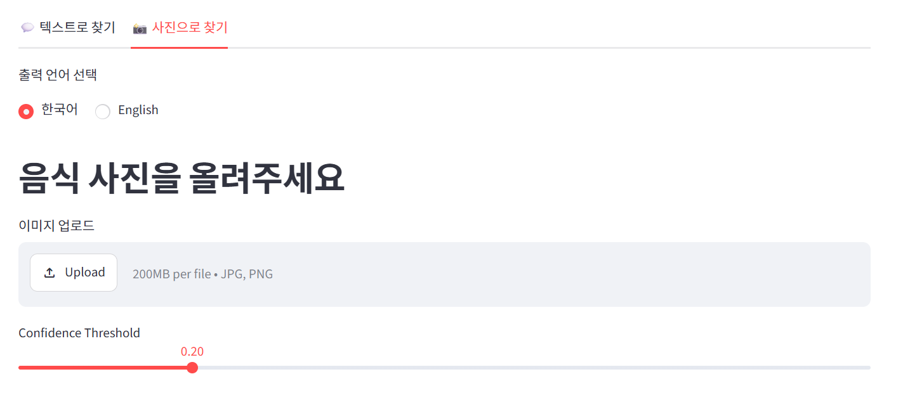
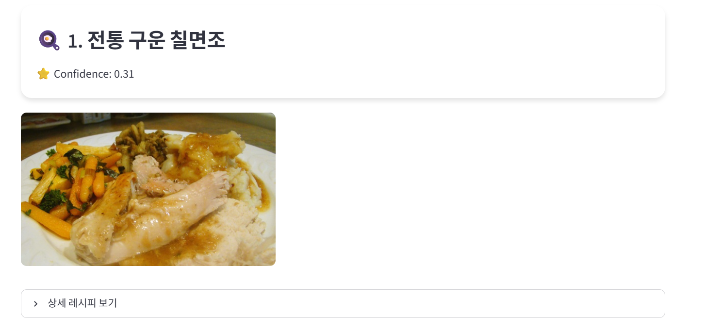

# 🍳 Find Recipe AI

텍스트 또는 음식 사진으로 레시피를 검색하는 AI 웹 애플리케이션입니다.

---

## 📌 프로젝트 소개

Recipe1M+ 데이터셋과 CLIP(ViT-B-32) 모델을 활용하여, 사용자가 입력한 텍스트(한국어/영어) 또는 업로드한 음식 사진을 기반으로 관련 레시피를 검색하고 추천합니다.

- 텍스트 검색: 한국어/영어 음식명 입력 → 레시피 제목, 재료, 조리법, 사진 출력
- 이미지 검색: 음식 사진 업로드 → CLIP으로 음식 분류 → 관련 레시피 검색

---

### 실행 화면 캡처




---

## 🛠 개발 환경 및 의존성

| 항목 | 내용 |
|------|------|
| OS | Windows |
| 가상환경 | Anaconda (`foodlens`) |
| GPU | NVIDIA GeForce RTX 4060 (VRAM 8GB) |
| CUDA | 13.1 |
| Python | （공란 — 버전 확인 필요） |

### 주요 라이브러리

```
streamlit
ultralytics
pillow
opencv-python
open_clip_torch
translators
torch
torchvision
requests
```

## 📚 Dataset

Recipe1M+

- 약 100만 개 이상의 레시피와 이미지로 구성
- 레시피 제목, 재료, 조리 순서 제공
- 프로젝트에서는 이미지 URL과 제목이 존재하는 샘플 중 최대 10,000개 사용

원본:
http://pic2recipe.csail.mit.edu/

## 🚀 설치 / 실행 방법

### 1. 가상환경 활성화

```bash
conda activate foodlens
```

### 2. 라이브러리 설치

```bash
pip install streamlit ultralytics pillow opencv-python translators
pip install torch torchvision
pip install open_clip_torch
```

### 3. 프로젝트 클론

```bash
git clone https://github.com/Park0504jh/Find_Recipe.git
cd Find_Recipe
```

### 4. 데이터 파일 준비

`recipe1M_layers` (layer1.json, layer2.json) 파일을 프로젝트 폴더 또는 지정된 경로에 배치합니다.

### 5. 앱 실행

```bash
streamlit run app.py
```

---

## 🔄 데이터 파이프라인

```
[Recipe1M+ 원본 데이터]
        │
        ├── layer1.json (레시피 제목 / 재료 / 조리법 텍스트)
        └── layer2.json (레시피별 이미지 URL)
        │
        ▼
[텍스트 검색 흐름]
사용자 입력(한/영) → 한국어 감지(is_korean) → 영어 번역(translators)
→ layer1.json 키워드 매칭 검색 → 결과 최대 5개 → 한국어 역번역 → 화면 출력
        │
        ▼
[이미지 검색 흐름]
사용자 이미지 업로드 → CLIP(clip_finetuned.pt)으로 음식 분류
→ 분류된 키워드로 레시피 검색 → image_loader.py로 레시피 사진 매칭 → 화면 출력
```

### 모델 학습 파이프라인 (CLIP 파인튜닝)

```
layer1.json (텍스트) + layer2.json (이미지 URL)
        ▼
이미지 다운로드 + 전처리 (open_clip preprocess)
        ▼
ViT-B-32 (openai pretrained) 파인튜닝
        ▼
Contrastive Loss 기반 학습 (5 Epochs, LR 1e-5)
        ▼
clip_finetuned.pt 저장
```

---

### 📂 파일 구조

| 파일 | 역할 |
|------|------|
| `app.py` | Streamlit 메인 앱, UI 렌더링, 텍스트/이미지 검색 탭 |
| `image_loader.py` | layer2.json 기반 레시피 이미지 URL 로더 |
| `train_clip.py` | CLIP 파인튜닝 학습 스크립트 |
| `clip_inference.py` | 학습된 CLIP 모델로 음식 이미지 분류 (추론) |
| `clip_finetuned.pt` | 학습 완료된 CLIP 모델 가중치 |

---

### 👥 팀원별 역할 분담

| 이름 | 역할 |
|------|------|
| **이지원** | 프로젝트 구상 및 계획, 전체 문서 작성, CLIP 모델 학습, 성능 지표 계산 |
| **박정현** | app.py 메인 개발, Streamlit 구현 |

---

## ⚠️ 한계점

- 데이터셋이 전부 영어로 구성되어 있어, 한국어 입력 시 번역 단계 추가로 인한 응답 지연 발생

---
